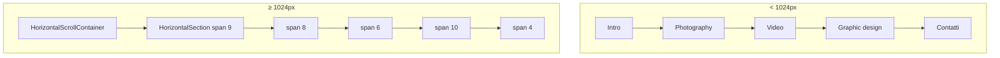

# Scroll orizzontale della homepage

Su viewport **desktop** (`lg`, da 1024px in su), la homepage (`/`) presenta le sezioni del portfolio come **pannelli affiancati** su un unico binario orizzontale: Intro, Photography, Video, Graphic design, Contatti. Su mobile le stesse sezioni sono **impilate in verticale** a tutta larghezza.

Per regolare sensibilità rotella, inerzia e fade degli hint, vedi [Tuning rotella e hint](./horizontal-wheel-tuning.md).

---

## Panoramica

| File | Ruolo |
|------|--------|
| [`src/app/page.js`](../src/app/page.js) | Composizione sezioni e props del container |
| [`src/components/home/HorizontalScrollContainer.client.js`](../src/components/home/HorizontalScrollContainer.client.js) | `<main>` scrollabile, rotella → scroll orizzontale, hint «Scroll» |
| [`src/components/home/HorizontalSection.js`](../src/components/home/HorizontalSection.js) | Pannello tematico (titolo, contenuto, larghezza modulare) |
| [`src/app/globals.css`](../src/app/globals.css) | Regole `.horizontal-section` e variabile `--vw-col` |

---

## Layout modulare (griglia 12 colonne)

La larghezza di ogni pannello su desktop è proporzionale al viewport:

`width = (span / 12) × 100vw`

- `span` è passato a `HorizontalSection` (1–12) e impostato come CSS custom property `--span`.
- In [`globals.css`](../src/app/globals.css), sotto `min-width: 1024px`, `.horizontal-section` ha `height: 100dvh`, `flex-shrink: 0` e `width: calc(100vw * var(--span, 12) / 12)`.
- La somma degli `span` nella home attuale è **37** (9+8+6+10+4): lo scroll orizzontale copre più di un viewport di larghezza.

Su mobile ogni sezione è `width: 100%` e `min-height: 100dvh`, con bordo inferiore tra una sezione e l’altra.

### Sezioni attuali (`page.js`)

| `id` | Titolo | `span` | Note |
|------|--------|--------|------|
| `intro` | Roberto Gianocca | 9 | Nav interna (`HomeIntroNav`) |
| `photography` | Photography | 8 | Titolo link a `/photography` |
| `video` | Video | 6 | Titolo link a `/video` |
| `graphic-design` | Graphic design | 10 | — |
| `contact` | Contatti | 4 | Form contatto |

Per aggiungere o ridimensionare una sezione: inserisci un altro `HorizontalSection` in `page.js` e scegli `span` in modo che la somma rifletta quanto spazio orizzontale vuoi dare al pannello.

---

## `HorizontalScrollContainer`

Client component che avvolge i figli in un `<main>` con classi Tailwind da `page.js`:

- `lg:flex-row lg:flex-nowrap lg:overflow-x-auto lg:overflow-y-hidden` — binario orizzontale solo su desktop.
- `aria-label="Sezioni portfolio"` — landmark per screen reader.

### Rotella del mouse → scroll orizzontale

Solo su desktop, con il puntatore sopra il track (o coordinate wheel dentro il rettangolo del `<main>`):

- La rotella **verticale** incrementa `scrollLeft` con **inerzia** (velocità + attrito, `requestAnimationFrame`).
- Gesti **orizzontali dominanti** (trackpad) non vengono intercettati: resta lo scroll nativo orizzontale.
- **Shift + rotella**: comportamento browser nativo (non intercettato).
- **`prefers-reduced-motion: reduce`**: niente inerzia; un `scrollBy` immediato per evento.

L’handler è registrato su `window` in capture con `{ passive: false }` per poter chiamare `preventDefault` sulla rotella verticale quando mappata.

Dettaglio costanti (`FRICTION`, `speed`, clamp, fade hint): [horizontal-wheel-tuning.md](./horizontal-wheel-tuning.md).

### Hint «Scroll» e sfumatura destra

Con `showScrollHints` (attivo sulla home), un overlay fisso a destra mostra:

- Gradiente che suggerisce contenuto oltre il bordo.
- Pill «Scroll →» con pulse leggero quando visibile.

L’opacità dipende dalla **percentuale di scroll** (`scrollLeft / maxScroll`), non dai pixel dalla fine: la sezione Contatti (`span` 4) è già visibile mentre resta ancora corsa scrollabile; un fade basato sui pixel lascerebbe hint sopra Contatti.

Aggiornamento: evento `scroll`, `resize`, `ResizeObserver` sul track, sync durante l’inerzia della rotella.

---

## `HorizontalSection`

Ogni sezione è un `<section>` con:

- `id` per ancore / navigazione.
- Header con `h2` (titolo plain o `Link` con icona se `titleHref` è impostato).
- Area contenuto con `overflow-y-auto` su mobile e `lg:overflow-hidden` su desktop (scroll verticale interno solo dove serve su schermi piccoli).

Bordi: `border-r` tra pannelli su desktop; `border-b` tra blocchi impilati su mobile.

---

## Modifiche frequenti

### Nuova sezione portfolio

1. Aggiungi `<HorizontalSection id="…" title="…" span={N}>…</HorizontalSection>` in `page.js`.
2. Aggiorna eventuali link in `HomeIntroNav` se la sezione deve essere raggiungibile dalla intro.
3. Verifica su `lg` che la somma degli `span` e lo scroll fino all’ultima sezione siano coerenti con gli hint (se `showScrollHints` è attivo).

### Disattivare hint o rotella custom

- Hint: `showScrollHints={false}` su `HorizontalScrollContainer`.
- Solo layout orizzontale senza logica rotella: il container aggiunge comunque il listener wheel su desktop; per rimuoverlo servirebbe un refactor (oggi rotella e layout sono nello stesso componente).

### Breakpoint

Desktop orizzontale e listener rotella usano **`1024px`**, allineato al breakpoint Tailwind `lg` e alle regole CSS di `.horizontal-section`.

---

## Accessibilità

- Landmark `<main>` con `aria-label`.
- Hint decorativi: `aria-hidden` quando opacità zero; pill non interattiva (`pointer-events-none` sull’overlay).
- Con `prefers-reduced-motion`, niente coasting inerziale.
- Sezioni con titoli in `<h2>`; link esterni al titolo con `sr-only` per etichetta aria quando serve.

---

## Documentazione correlata

| Argomento | File |
|-----------|------|
| Numeri di tuning (friction, speed, fade) | [horizontal-wheel-tuning.md](./horizontal-wheel-tuning.md) |
| Form nella sezione Contatti | [contact-form-resend.md](./contact-form-resend.md) |
