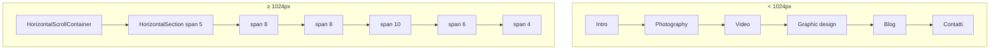

# Scroll orizzontale della homepage

Su viewport **desktop** (`lg`, da 1024px in su), la homepage (`/`) presenta le sezioni del portfolio come **pannelli affiancati** su un unico binario orizzontale: Intro, Photography, Video, Graphic design, Blog, Contatti. Su mobile le stesse sezioni sono **impilate in verticale** a tutta larghezza.

Per regolare sensibilità rotella, inerzia e fade degli hint, vedi [Tuning rotella e hint](./horizontal-wheel-tuning.md).

---

## Panoramica

```mermaid
flowchart TB
  subgraph mobile["&lt; 1024px"]
    S1[Intro]
    S2[Photography]
    S3[Video]
    S4[Graphic design]
    S5[Blog]
    S6[Contatti]
    S1 --> S2 --> S3 --> S4 --> S5 --> S6
  end
  subgraph desktop["≥ 1024px"]
    HSC[HorizontalScrollContainer]
    HS1[HorizontalSection span 5]
    HS2[span 8]
    HS3[span 8]
    HS4[span 10]
    HS5[span 6]
    HS6[span 4]
    HSC --> HS1 --> HS2 --> HS3 --> HS4 --> HS5 --> HS6
  end
```

| File | Ruolo |
|------|--------|
| [`src/app/[locale]/page.js`](../src/app/%5Blocale%5D/page.js) | Composizione sezioni e props del container |
| [`src/components/home/HorizontalScrollContainer.client.js`](../src/components/home/HorizontalScrollContainer.client.js) | `<main>` scrollabile, rotella → scroll orizzontale, hint «Scroll» |
| [`src/components/home/HorizontalSection.js`](../src/components/home/HorizontalSection.js) | Pannello tematico (titolo, contenuto, larghezza modulare) |
| [`src/components/home/HomeThumbRow.js`](../src/components/home/HomeThumbRow.js) | Riga thumbnail + link «tutte» condivisa da Photography e Video |
| [`src/app/globals.css`](../src/app/globals.css) | Regole `.horizontal-section` (larghezza da `--span`, altezza al netto di nav e footer) |

---

## Layout modulare (griglia 12 colonne)

La larghezza di ogni pannello su desktop è proporzionale al viewport:

`width = (span / 12) × 100vw`

- `span` è passato a `HorizontalSection` (1–12) e impostato come CSS custom property `--span`.
- In [`globals.css`](../src/app/globals.css), sotto `min-width: 1024px`, `.horizontal-section` ha `flex-shrink: 0` e `width: calc(100vw * var(--span, 12) / 12)`.
- La somma degli `span` nella home attuale è **41** (5+8+8+10+6+4): a 1440px di viewport il track misura 4920px, cioè poco più di tre schermate.

Su mobile ogni sezione è `width: 100%`.

### Altezza: nav e footer sono fissi

`SiteNavBar` è `fixed` in alto (`--site-nav-height`, 36px) e `SiteFooter` è `fixed` in basso da `md` in su (`--site-footer-height`, 160px). Entrambi **coprono** il track, quindi l'altezza dei pannelli li sottrae:

| Breakpoint | Regola |
|------------|--------|
| `< 768px` | `min-height: calc(100dvh - var(--site-nav-height))` (footer in flusso) |
| `≥ 768px` | `min-height: calc(100dvh - var(--site-nav-height) - var(--site-footer-height))` |
| `≥ 1024px` | `height: calc(100dvh - var(--site-nav-height) - var(--site-footer-height))`, `min-height: 0` |

Senza questa sottrazione il fondo di ogni pannello finiva **sotto** il footer: su 1440×800 sparivano il pulsante «Invia messaggio», i link «tutte le foto/gallerie» e l'intera riga dei video recenti. Il footer ha `pointer-events-none`, quindi restavano cliccabili pur essendo invisibili.

Se cambi `--site-nav-height` o `--site-footer-height` in `:root`, le altezze si adeguano da sole.

### Contenuto più alto della banda visibile

L'area contenuto di `HorizontalSection` è `overflow-y-auto` a tutti i breakpoint. Su viewport bassi (sotto ~900px di altezza) alcuni pannelli superano lo spazio disponibile: invece di essere tagliati, scorrono. La rotella lo rispetta — vedi `wantsNativeVerticalScroll` in [tuning](./horizontal-wheel-tuning.md) — quindi prima scorre il contenuto del pannello e poi riprende lo scorrimento orizzontale.

Sopra i ~900px di altezza nessun pannello va in overflow e il comportamento è identico a prima.

### Sezioni attuali (`page.js`)

| `id` | Titolo | `span` | Note |
|------|--------|--------|------|
| `intro` | — (h2 `sr-only`) | 5 | Testo di benvenuto + nav interna (`HomeIntroNav`) |
| `photography` | `Home.photographyTitle` | 8 | Titolo link a `/photography`, mosaico + `HomeThumbRow` |
| `video` | `Home.videoTitle` | 8 | Titolo link a `/video`, player + `HomeThumbRow` |
| `graphic-design` | `Home.graphicDesignTitle` | 10 | `PlaceholderGrid variant="mixed"` |
| `blog` | `Home.blogTitle` | 6 | Ultimi 2 post, `BlogCard` con `headingLevel={3}` |
| `contact` | `Home.contactTitle` | 4 | Form contatto |

I titoli vivono in `messages/{it,en}.json` sotto `Home`: non scriverli inline in `page.js`. Gli stessi valori alimentano le voci di `HomeIntroNav`, così ogni etichetta è definita una volta sola.

Per aggiungere o ridimensionare una sezione: inserisci un altro `HorizontalSection` in `page.js` e scegli `span` in modo che la somma rifletta quanto spazio orizzontale vuoi dare al pannello.

---

## `HorizontalScrollContainer`

Client component che avvolge i figli in un `<main>` con classi Tailwind da `page.js`:

- `lg:flex-row lg:flex-nowrap lg:overflow-x-auto lg:overflow-y-hidden` — binario orizzontale solo su desktop.
- `aria-label="Sezioni portfolio"` — landmark per screen reader.

### Rotella del mouse → scroll orizzontale

Solo su desktop, quando `document.elementFromPoint` conferma che il puntatore è davvero sopra il track:

- La rotella **verticale** incrementa `scrollLeft` con **inerzia** (velocità + attrito, `requestAnimationFrame`).
- Gesti **orizzontali dominanti** (trackpad) non vengono intercettati: resta lo scroll nativo orizzontale.
- **Shift + rotella**: comportamento browser nativo (non intercettato).
- **Nav e footer fissi**: si sovrappongono al track ma non contano come «sopra il track», quindi la rotella lì resta nativa (serve alla filmstrip del footer sulla pagina Video).
- **Contenuto verticale scrollabile**: se il pannello sotto il puntatore ha ancora corsa verticale nella direzione della rotella, l'evento resta nativo finché non arriva a fondo.
- **`prefers-reduced-motion: reduce`**: niente inerzia; un `scrollBy` immediato per evento.

L’handler è registrato su `window` in capture con `{ passive: false }` per poter chiamare `preventDefault` sulla rotella verticale quando mappata.

Dettaglio costanti (`FRICTION`, `speed`, clamp, fade hint): [horizontal-wheel-tuning.md](./horizontal-wheel-tuning.md).

### Hint «Scroll» e sfumatura destra

Con `showScrollHints` (attivo sulla home), un overlay fisso a destra mostra:

- Gradiente che suggerisce contenuto oltre il bordo.
- Pill «Scroll →» con pulse leggero quando visibile.

L’opacità dipende dalla **percentuale di scroll** (`scrollLeft / maxScroll`), non dai pixel dalla fine: la sezione Contatti (`span` 4) è già visibile mentre resta ancora corsa scrollabile; un fade basato sui pixel lascerebbe hint sopra Contatti.

Aggiornamento: evento `scroll`, `resize`, `ResizeObserver` sul track, sync durante l’inerzia della rotella.

---

## `HorizontalSection`

Ogni sezione è un `<section>` con:

- `id` per ancore / navigazione.
- Header con `h2` (titolo plain o `Link` con icona se `titleHref` è impostato).
- Area contenuto con `overflow-y-auto` a tutti i breakpoint: la barra compare solo quando il contenuto supera davvero l'altezza del pannello.

Bordi: `border-r` tra pannelli su desktop; `border-b` tra blocchi impilati su mobile.

---

## Modifiche frequenti

### Nuova sezione portfolio

1. Aggiungi `<HorizontalSection id="…" title="…" span={N}>…</HorizontalSection>` in `page.js`.
2. Aggiorna eventuali link in `HomeIntroNav` se la sezione deve essere raggiungibile dalla intro.
3. Verifica su `lg` che la somma degli `span` e lo scroll fino all’ultima sezione siano coerenti con gli hint (se `showScrollHints` è attivo).

### Disattivare hint o rotella custom

- Hint: `showScrollHints={false}` su `HorizontalScrollContainer`.
- Solo layout orizzontale senza logica rotella: il container aggiunge comunque il listener wheel su desktop; per rimuoverlo servirebbe un refactor (oggi rotella e layout sono nello stesso componente).

### Breakpoint

Desktop orizzontale e listener rotella usano **`1024px`**, allineato al breakpoint Tailwind `lg` e alle regole CSS di `.horizontal-section`.

---

## Accessibilità

- Landmark `<main>` con `aria-label`.
- Hint decorativi: `aria-hidden` quando opacità zero; pill non interattiva (`pointer-events-none` sull’overlay).
- Con `prefers-reduced-motion`, niente coasting inerziale.
- Sezioni con titoli in `<h2>`; link esterni al titolo con `sr-only` per etichetta aria quando serve.

---

## Documentazione correlata

| Argomento | File |
|-----------|------|
| Numeri di tuning (friction, speed, fade) | [horizontal-wheel-tuning.md](./horizontal-wheel-tuning.md) |
| Form nella sezione Contatti | [contact-form-resend.md](./contact-form-resend.md) |
