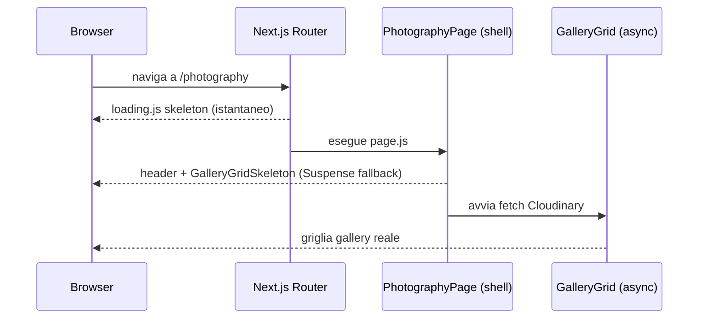

# Loading skeleton della sezione Photography

Alla prima visita (o quando la cache Cloudinary è fredda), le pagine Photography devono fare
fetch verso l'API Cloudinary prima di poter inviare HTML al browser. Senza feedback visivo il
risultato è una schermata bianca/bloccata che dà l'impressione di un errore.

Questa integrazione aggiunge uno stato di caricamento strutturato a entrambe le pagine della
sezione: **listing** (`/photography`) e **gallery detail** (`/photography/[slug]`).

---

## Problema

Entrambe le pagine erano **async Server Components** che attendevano tutti i dati Cloudinary
prima di inviare qualsiasi HTML. L'utente vedeva una schermata vuota per tutta la durata del
fetch, senza alcun segnale visivo.

| Pagina | Bottleneck |
|--------|-----------|
| `/photography` | `Promise.all` su tutte le cover degli album (N richieste Cloudinary in parallelo) |
| `/photography/[slug]` | `fetchFolderGalleryDetail` (lista completa slide) — principalmente in dev/cold start |

---

## Soluzione

Due meccanismi combinati:

1. **`loading.js`** — file Next.js che avvolge automaticamente la pagina in un `<Suspense>`.
   Mostrato dal router durante la navigazione client-side, mentre il Server Component inizia
   l'esecuzione. Il layout e la navigazione globale rimangono visibili immediatamente.

2. **Suspense interno + `GalleryGrid`** — la parte lenta del listing page (fetch cover +
   rendering griglia) è estratta in un componente asincrono separato (`GalleryGrid`) e
   avvolta in un `<Suspense>`. Questo permette all'header della pagina (titolo, back-link,
   tag filter) di apparire **immediatamente**, sostituendo la griglia con un placeholder
   animato durante l'attesa.



---

## File coinvolti

```
src/
├── components/photography/
│   └── GalleryGrid.js                          (nuovo)
└── app/[locale]/photography/
    ├── loading.js                              (nuovo)
    ├── page.js                                 (modificato)
    └── [slug]/
        └── loading.js                          (nuovo)
```

### `GalleryGrid.js`

Contiene due export:

- **`GalleryGrid`** — async Server Component. Esegue il `Promise.all` delle cover Cloudinary
  e restituisce la `<ul>` con le card. Gestisce anche lo stato "nessun risultato" con il
  messaggio tradotto. Era precedentemente inline in `page.js`.

- **`GalleryGridSkeleton`** — componente sincrono. Griglia di card placeholder con
  `animate-pulse`. Accetta `count` per mostrare esattamente quante card ci si aspetta,
  evitando layout shift.

### `page.js` (listing) — modifica

La logica di fetch cover è rimossa dal body della pagina. Al suo posto:

```jsx
<Suspense fallback={<GalleryGridSkeleton count={filtered.length || 6} />}>
  <GalleryGrid filtered={filtered} locale={locale} activeTag={activeTag} />
</Suspense>
```

`filtered` (array di metadati statici) è noto sincronamente, quindi il conteggio corretto
di placeholder è disponibile prima che il fetch inizi.

### `loading.js` (listing)

Skeleton completo della pagina: replica la struttura di `PageShell` con blocchi pulse per
back-link, titolo, descrizione, tag pill, e riusa `GalleryGridSkeleton` per il corpo.
Mostrato dal router durante la navigazione tra route.

### `[slug]/loading.js`

Skeleton del layout a due pannelli di `GallerySlideshow`:

- **Mobile**: header con pulse + pannello scuro con spinner
- **Desktop**: sidebar (back-link, titolo, testo, pulsanti prev/next, griglia miniature
  5×2) + pannello principale scuro con spinner

Lo skeleton è statico (non riceve `params`), quindi usa classi Tailwind che corrispondono
esattamente alle classi reali del componente per evitare layout shift visibile.

---

## Comportamento per contesto

| Contesto | Listing `/photography` | Detail `/photography/[slug]` |
|----------|----------------------|------------------------------|
| **Produzione (cache calda)** | Header immediato, Suspense quasi invisibile | SSG: pagina statica, nessun loading |
| **Produzione (cache fredda / prima build)** | `loading.js` → header + `GalleryGridSkeleton` → griglia | `loading.js` → skeleton → slideshow |
| **Dev mode** | Stessa sequenza, più lenta per mancanza di cache | Visibile ad ogni ricarica |
| **Navigazione client-side** | `loading.js` mostrato mentre il SC si avvia | `loading.js` mostrato mentre il SC si avvia |

---

## Note

- Il `GalleryGridSkeleton` è condiviso tra `GalleryGrid.js` e `loading.js` per garantire
  coerenza visiva tra il fallback Suspense interno e il `loading.js` di route.
- La pagina `[slug]` usa `generateStaticParams` + `dynamicParams = false`: in produzione è
  completamente pre-renderizzata, quindi il suo `loading.js` è rilevante solo in sviluppo o
  durante il primo build ISR.
- Il probe Cloudinary (solo dev, `PHOTOGRAPHY_ENABLE_PROBE=1`) rimane nel corpo della pagina
  fuori dal `<Suspense>`: essendo un tool di debug, un eventuale ritardo è accettabile.
